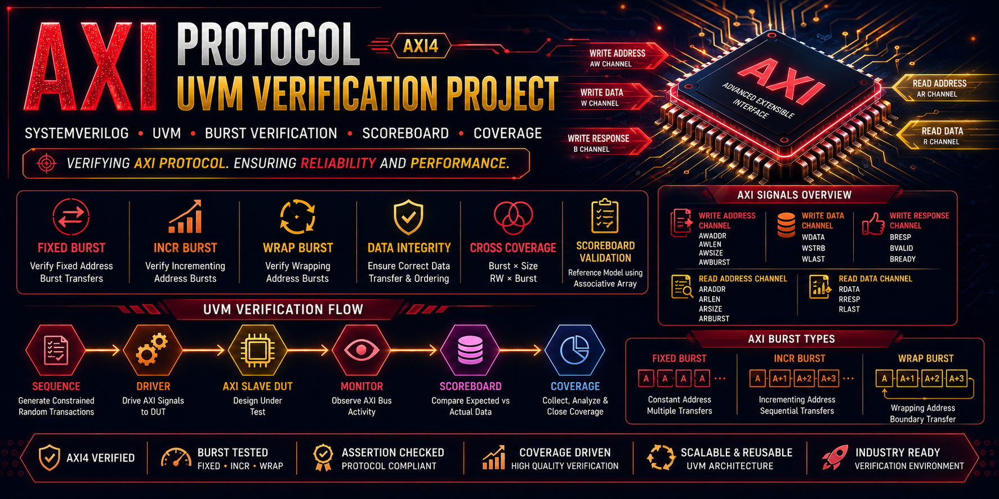

# 🚀 AXI Protocol UVM Verification Project



## 🌟 Advanced AXI4 Verification Environment using UVM and SystemVerilog

---

## 📌 Project Overview

This project implements a complete UVM-based verification environment for the AXI4 Protocol.

The verification environment validates AXI read and write transactions across multiple burst modes including **FIXED**, **INCR**, and **WRAP** bursts.

The testbench uses constrained-random stimulus generation, functional coverage collection, cross coverage analysis, and scoreboard-based checking to ensure protocol compliance and data integrity.

The architecture follows industry-standard UVM methodology and demonstrates advanced protocol verification techniques used in modern SoC verification environments.

---

## 🎯 Verification Objectives

✅ Verify AXI Write Transactions

✅ Verify AXI Read Transactions

✅ Verify FIXED Burst Transfers

✅ Verify INCR Burst Transfers

✅ Verify WRAP Burst Transfers

✅ Verify Burst Length Handling

✅ Verify Data Integrity

✅ Verify Address Alignment

✅ Functional Coverage Closure

✅ Scoreboard Validation

---

## 🏗️ UVM Verification Architecture

```text
                    +----------------+
                    |      TEST      |
                    +-------+--------+
                            |
                            v
                    +----------------+
                    |      ENV       |
                    +-------+--------+
                            |
                            v
                    +----------------+
                    |    AXI AGENT   |
                    +-------+--------+
                            |
                +-----------+-----------+
                |                       |
                v                       v
          +-----------+          +-----------+
          |  DRIVER   |          |  MONITOR  |
          +-----+-----+          +-----+-----+
                |                      |
                v                      |
          +-----------+                |
          | AXI DUT   | <--------------+
          +-----------+
                |
                v
          +-----------+
          | SCOREBOARD|
          +-----------+
                |
                v
          +-----------+
          | COVERAGE  |
          +-----------+
````

---

## 📂 Project Structure

```text
AXI_PROTOCOL/

├── RTL/
│   ├── axi_mem_slave.v
│   └── sync_fifo.v
│
├── TB/
│
├── ENV/
│   └── axi_env.sv
│
├── AGENTS/
│   ├── axi_agent.sv
│   ├── axi_drv.sv
│   ├── axi_mon.sv
│   ├── axi_sqr.sv
│   ├── axi_tx.sv
│   └── axi_cov.sv
│
├── SBD/
│   └── axi_sbd.sv
│
├── SEQ_LIB/
│   ├── axi_base_seq.sv
│   ├── axi_fixed_burst_seq.sv
│   ├── axi_incr_burst_seq.sv
│   ├── axi_wrap_burst_seq.sv
│   └── axi_rand_seq.sv
│
├── TEST_LIB/
│   ├── axi_base_test.sv
│   ├── axi_fixed_burst_test.sv
│   ├── axi_incr_burst_test.sv
│   ├── axi_wrap_burst_test.sv
│   └── axi_rand_test.sv
│
├── TOP/
│   ├── axi_if.sv
│   ├── common.sv
│   └── top.sv
│
└── SIM/
    ├── run.do
    └── list.svh
```

---

## 🧩 UVM Components

### 📦 Transaction

Represents AXI protocol transactions containing:

* Address Information
* Burst Type
* Burst Length
* Transfer Size
* Write Data
* Read Data

### 🚗 Driver

Responsible for driving AXI bus transactions to the DUT.

**Responsibilities:**

* Write Address Channel Handling
* Write Data Channel Handling
* Read Address Channel Handling
* Protocol Timing Control

### 👀 Monitor

Passively observes AXI bus activity.

Captures:

* Address Transactions
* Burst Transactions
* Read Data
* Write Data

and forwards them through Analysis Ports.

### 🎛️ Sequencer

Controls transaction flow between sequences and driver.

Supports:

* FIXED Burst Sequences
* INCR Burst Sequences
* WRAP Burst Sequences
* Randomized Transactions

### 🏢 Agent

Encapsulates:

* Driver
* Monitor
* Sequencer

into a reusable verification component.

### 📊 Scoreboard

Reference model used for protocol and data integrity checking.

**Features:**

* Expected vs Actual Comparison
* Burst Data Validation
* Transaction Matching
* Error Reporting

---

## 📊 Functional Coverage

### Coverage Points

* Address Coverage
* Burst Type Coverage
* Transfer Size Coverage
* Burst Length Coverage
* Read/Write Operation Coverage

### Cross Coverage

* Burst × Size
* Read/Write × Burst

This ensures comprehensive verification of all legal AXI transfer combinations.

---

## 🧪 Implemented Test Cases

### 1️⃣ FIXED Burst Test

Verifies:

* Constant Address Transfers
* Burst Length Handling
* Data Integrity

### 2️⃣ INCR Burst Test

Verifies:

* Incrementing Addresses
* Sequential Data Transfers
* Address Progression Logic

### 3️⃣ WRAP Burst Test

Verifies:

* Wrapping Address Calculations
* Boundary Conditions
* Burst Compliance

### 4️⃣ Random AXI Test

Verifies:

* Randomized Burst Parameters
* Protocol Robustness
* Coverage Closure

---

## 🔍 Scoreboard Validation

The scoreboard validates all read and write transactions by comparing expected and actual DUT behavior.

Checks include:

* Data Integrity
* Burst Ordering
* Address Consistency
* Transaction Matching

---

## ⚡ AXI Features Verified

### FIXED Burst

* Constant Address Transfers

### INCR Burst

* Incrementing Address Transfers

### WRAP Burst

* Wrapping Address Calculations

### Read Channel Verification

* ARADDR
* ARLEN
* ARSIZE
* ARBURST

### Write Channel Verification

* AWADDR
* AWLEN
* AWSIZE
* AWBURST
* WDATA

---

## 🛠️ Tools Used

* SystemVerilog
* UVM
* QuestaSim
* ModelSim

---

## 🌟 Key Verification Features

✅ UVM Architecture

✅ AXI4 Protocol Verification

✅ FIXED Burst Verification

✅ INCR Burst Verification

✅ WRAP Burst Verification

✅ Functional Coverage

✅ Cross Coverage

✅ Scoreboard Validation

✅ Constrained Random Verification

✅ Reusable Components

---

## 📚 Learning Outcomes

This project demonstrates practical experience with:

* AXI4 Protocol
* UVM Methodology
* Functional Coverage
* Cross Coverage
* Scoreboard Design
* Burst Verification
* Protocol Verification
* Verification Planning
* Coverage Closure

---

## 👨‍💻 Author

### Rakesh Magapu

**VLSI Design & Verification Engineer**

📌 Skills:

* Verilog
* SystemVerilog
* UVM
* Assertions (SVA)
* Functional Verification
* RTL Design
* Protocol Verification

⭐ If you found this project useful, consider giving the repository a star.
